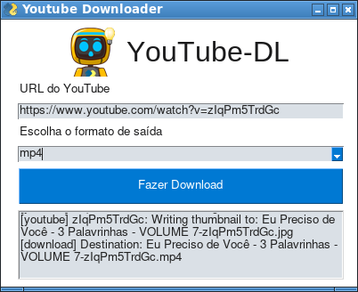

# YouTube Downloader by PyTube
 

## O que é o YouTube Downloader by PyTube?

**YouTube Downloader by PyTube ** é um software simples para baixar vídeos no YouTube com a qualidade máxima. **YouTube Downloader by PyTube** usa a biblioteca
[pytube](https://pytube.io/en/latest/), uma lib riquíssima cheia de recursos para baixar vídeos e áudio no YouTube. **YouTube Downloader by PyTube** não usa todos os recursos do pytube, apenas baixa vídeos no youtube com a qualidade máxima e também, caso o usuário tenha o **wget**, baixa a capa do vídeo...
A interface gráfica é gerada pela lib PySimpleGUI...

## Como usar o YouTube Downloader by PyTube?

Primeiramente clone este repositório com o comando abaixo:
 
~~~python

git clone https://github.com/elizeubarbosaabreu/Youtube-Downloader-by-PyTube.git

~~~

Se estiver usando o **Linux** ou **MAC** use os comandos abaixo para criar uma virtual env e instalar as dependências:
 
~~~python

cd Youtube-Downloader-by-PyTube
python3 -m venv .venv
source .venv/bin/activate
pip install -r requirements.txt

~~~

No **Windows** use os comandos abaixo para criar uma virtual env e instalar as dependências:
 
~~~python

cd Youtube-Downloader-by-PyTube
python3 -m venv .venv
source .venv\Scripts\activate.bat
pip install -r requirements.txt

~~~

Perceba que apareceu um *.env* antes do nome da máquina no terminal.

Teste o software:
 
~~~python

python app.py

~~~

Caso esteja tudo ok, transforme o arquivo py em executável com o pyinstaller:
 
~~~python

pyinstaller app.py

~~~

O executável estará em uma subpasta */dist/app* com o nome app.exe ou com outra extensão a depender do sistema operacional. Copie a folder app com todo o conteúdo para o disco que quiser. Gere um atalho para o arquivo executável app.exe em seu interior...

## Raspberry PI

No **raspberry os** após rodar todos os comandos acima inclusive o pyinstaller app.py (lembrando que o raspiberry roda Linux) use o comando em modo root para mover o executável para a pasta /opt:
 
~~~python

sudo mv dist/app/ /opt/PyTube

~~~

Agora com **alacarte** (menu/Preferências/Main Menu Editor) crie um atalho para */opt/PyTube/app*:
 

## Pronto agora só fazer bom uso do software...